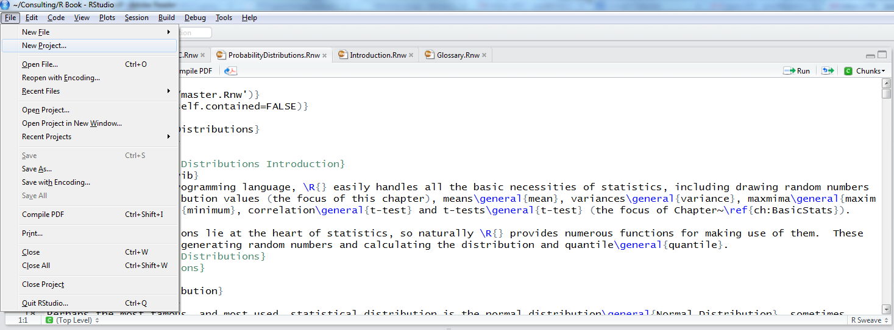
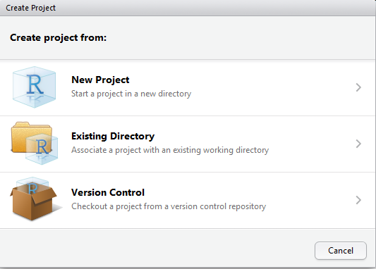
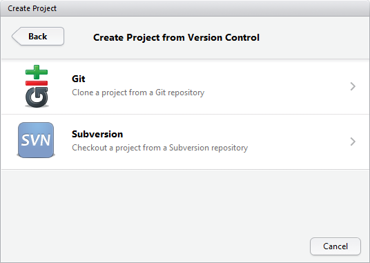
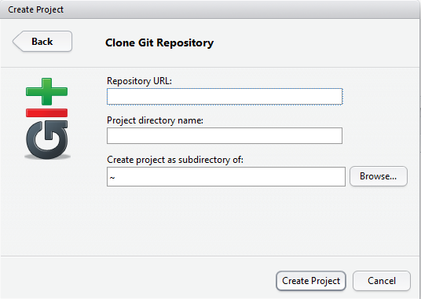

```{r, echo = FALSE}
knitr::opts_chunk$set(
  collapse = TRUE,
  comment = "#>",
  fig.path = "README-"
)
```

```{js,echo=FALSE}
code .sourceCode {
    white-space: pre-wrap;       /* Since CSS 2.1 */
    white-space: -moz-pre-wrap;  /* Mozilla, since 1999 */
    white-space: -pre-wrap;      /* Opera 4-6 */
    white-space: -o-pre-wrap;    /* Opera 7 */
    word-wrap: break-word;       /* Internet Explorer 5.5+ */
    overflow-wrap: break-word;
}
```


```{r settings,echo=FALSE, include=FALSE}
className <- params$className
organizer <- params$organizer
packages <- sort(params$packages)
```

# R Class

This is an empty repo to initialize an R project for class at by `r organizer`. Both [Part I](https://odsc.com/speakers/machine-learning-in-r-part-i-penalized-regression-and-boosted-trees/) and [Part II](https://odsc.com/speakers/machine-learning-in-r-part-iii-forecasting-time-series-data/) (yes, this is Part II even though it says Part III on the site) will work out of this repo.

Please __follow all instructions__ to set up your environment for the training. Skimming the instructions often leads to errors, so be sure to read everything.

# Install R and RStudio

This is just like installing any other program.

- [R](https://cloud.r-project.org/)
- [RStudio](https://www.rstudio.com/products/rstudio/download/#download)

# Getting the Repo

In order to get the most out of class you have to be working in this project. There are three ways to get this project on your computer.

Choose __one of these methods__.

1. Clone the repo using the command line
1. Clone the repo using the RStudio GUI
1. Use the [`{usethis}`](https://usethis.r-lib.org) package to download and unzip the repo

Please only follow one of these methods. Attempting more than one can lead to errors.

## Command Line

This assumes you have `git` [installed](https://git-scm.com/book/en/v2/Getting-Started-Installing-Git).^[Can also be done with ssh instead of https.]

Run this command in the command line or shell.^[Or `r sprintf("git clone git@github.com:%s/%s.git", params$repoOwner, params$repoName)` for ssh.]

```sh
git clone `r sprintf("https://github.com/%s/%s.git", params$repoOwner, params$repoName)`
```

Then open the ``r sprintf("%s.Rproj", params$repoName)`` file.

## RStudio Gui

This assumes you have `git` [installed](https://git-scm.com/book/en/v2/Getting-Started-Installing-Git).

Click `File > New Project`.

```{r new-project-click,echo=FALSE}

```

Click `Version Control`.

```{r version-control-click,echo=FALSE}

```

Click `Git`.

```{r git-click,echo=FALSE}

```

Choose a folder in the `Create project as a subdirectory of` field.

Paste ``r sprintf('https://github.com/%s/%s', params$repoOwner, params$repoName)``^[Or `r sprintf("git@github.com:%s/%s.git", params$repoOwner, params$repoName)` for ssh.] in the `Repository URL` field.

```{r paste-url,echo=FALSE}

```

## `usethis` Package

Run these commands in the R console.

```r
# install usethis package
install.packages('usethis')

# get the repo
newProject <- usethis::use_course('https://github.com/`r params$repoOwner`/`r params$repoName`/archive/master.zip')
```

Be sure to select the positive prompts such as `yes`, `yeah`, etc.

This will open the project in a new RStudio window.

After any of these methods you should have a new RStudio project called ``r params$repoName`` or ``r sprintf("%s-master", params$repoName)``. You can see this in the top right of RStudio (the name in the image may be different).

```{r proj-corner,echo=FALSE}
knitr::include_graphics('images/ProjectCorner.png')
```

# Finish Setup

Setting up all of the needed packages^[Linux users might need to install `libxml2-dev` and `zlib1g-dev`] and data will be handled by running the following line of code in the R console.

```{r source-setup,eval=FALSE}
source('prep/setup.r')
```

If asked to compile from source, select `no`.

Otherwise, answer `y` to any questions asked in the terminal.

# All Done

That's everything. You should now do all of your work for this class in this project.

# If It Still Does Not Work

If you are still having trouble setting up the project and getting everything installed, sign up for an [RStudio.cloud](https://rstudio.cloud/) account, contact the TA and ask for access to the class project.^[The compute instance has limited processing and memory so performance on some topics may be suboptimal.]

# Footnotes
